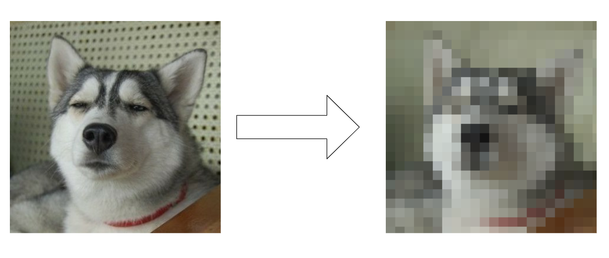

# Image Processing

This is a pure C implementation of image mosaic compared with OpenMP and CUDA acceleration. The input image accept both binary and plain text PPM ([description of the format](http://netpbm.sourceforge.net/doc/ppm.html))



## Dependency

- C compiler
- OpenMP support
- Nvidia GPU and CUDA, optional
- Cmake

## Usage

Download the repository and change directory to the workspace

```sh
git clone https://github.com/yzheng51/image-processing.git
cd image-processing
```

If there is no Nvidia GPU on your device, checkout to openmp branch

```sh
git checkout openmp
```

Build from the source

```sh
mkdir build
cd build
cmake ..
make
```

Executable will be created in `./bin`, the usage is

```sh
mosaic C M -i input_file -o output_file [options]
where:
        C              Is the mosaic cell size which should be any positive
                       power of 2 number
        M              Is the mode with a value of either CPU, OPENMP, CUDA or
                       ALL. The mode specifies which version of the simulation
                       code should execute. ALL should execute each mode in
                       turn.
        -i input_file  Specifies an input image file
        -o output_file Specifies an output image file which will be used
                       to write the mosaic image
[options]:
        -f ppm_format  PPM image output format either PPM_BINARY (default) or
                       PPM_PLAIN_TEXT
```

e.g. for the sample image

```sh
./bin/mosaic 16 CPU -i ./images/sample.ppm -o output.ppm
```
# PCAP

